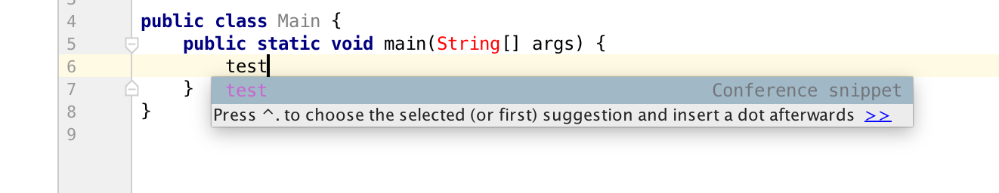
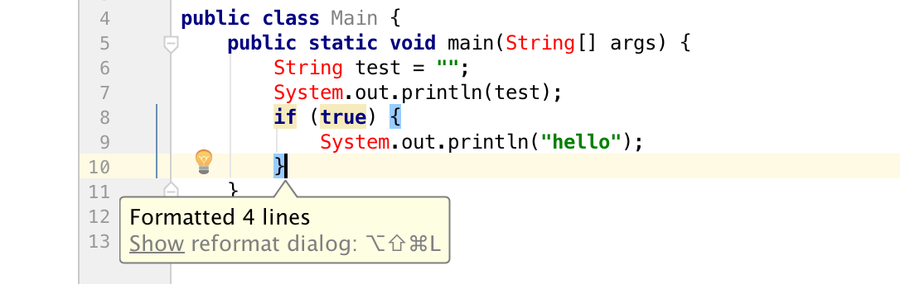

# Conference snippet plugin

Sometimes you need to do live demos and you want to make sure the
code you type is the one you want to show, preferably without any typos.

You can currently use live templates in order to put all your demo snippets in 
your IDE in advance, but those are global and you may not want to clutter your configuration 
with these one-off snippets.

This plugin allows you to put a file in the root of your
project called `.snippets.toml` and define snippets in there. IntelliJ will then pick
these snippets up into the autocompletion dialog.

The plugin uses the TOML format to define snippets. An example:

```
test = '''
String test = "";
System.out.println(test);
if(true) {
System.out.println("hello");
}
'''
```

If you now type `test` into your IDE, you'll get an autocomplete
suggestion.



After pressing enter, the corresponding code snippet will be inserted and
the code will automatically be reformatted.


